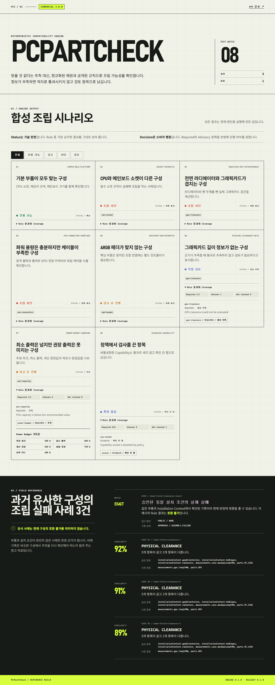

# PCPartCheck

PCPartCheck는 PC 부품 사양을 공급처와 무관한 Canonical 형식으로 정리하고, 선택한 조합을 결정론적 규칙으로 검사하는 TypeScript 모노레포입니다. 같은 입력, 정책, 버전, Evidence를 다시 넣으면 같은 결과가 나와야 한다는 원칙으로 만들었습니다.


## 이 프로젝트가 하는 일

CPU 소켓과 메모리 세대처럼 명확한 일치 조건부터 케이스 내부 공간, 냉각, 저장장치 자원, PSU 용량과 커넥터까지 검사합니다. 데이터가 부족한 항목은 추정해 통과시키지 않고 `UNKNOWN`으로 남깁니다. 결과에는 사용한 입력, Evidence, 엔진·RuleSet·Schema·Provider 버전이 함께 들어가므로 당시 판정을 재현할 수 있습니다.

현재 패키지와 엔진 버전은 `0.1.0`입니다. Canonical Schema `3.0.0`, Installation Context `2.0.0`, Field Evidence `3.0.0`, Result Snapshot `2.0.0`, Identity Mapper `1.1.0`을 사용합니다. 이 버전들은 서로 다른 계약을 나타내며 한꺼번에 같은 번호로 올리지 않습니다. 세부 정책은 [Versioning 문서](docs/VERSIONING.md)에 있습니다.

## 하지 않는 일

PCPartCheck는 모든 부품 조합의 실제 조립 가능성을 보증하지 않습니다. 제조사 BIOS 지원 목록이나 메모리 QVL을 실시간으로 수집하지 않고, 열·소음·성능을 시뮬레이션하지도 않습니다. Reference API와 Demo는 배포 제품이 아니라 계약과 사용 흐름을 확인하기 위한 예제입니다. Demo에 보이는 부품과 Field Evidence는 모두 합성 데이터입니다.

## 설계 원칙

- `@pcpartcheck/core`는 다른 내부 패키지를 가져오지 않습니다.
- Rule은 Provider 원본 필드가 아니라 버전이 있는 Canonical field만 읽습니다.
- 단위 변환과 dimension 검증은 `@pcpartcheck/unit-normalization`이 맡고, 원본 값과 단위는 Audit에 남깁니다.
- 정보가 없으면 `PASS`로 간주하지 않습니다.
- Capability는 `REQUIRED`, `ADVISORY`, `DISABLED` 중 하나로 정책을 정합니다.
- LLM은 설명과 후보 정리에만 쓰며 Status, Decision, Identity 확정값을 바꿀 수 없습니다.
- Result Snapshot은 판정에 사용한 버전과 입력·Evidence·결과를 함께 보존합니다.

구조와 실행 흐름은 [Architecture 문서](docs/ARCHITECTURE.md)에 정리했습니다.

## Status와 Decision

`Status`는 규칙이 발견한 기술적 사실입니다. `PASS`, `WARNING`, `CONDITIONAL`, `UNKNOWN`, `REVIEW_REQUIRED`, `INCOMPATIBLE`, `NOT_CHECKED`가 있습니다. `Decision`은 그 사실에 Capability 정책을 적용한 소비자용 결론입니다.

예를 들어 REQUIRED 규칙의 `INCOMPATIBLE`은 `BLOCK`이지만, ADVISORY 규칙의 `INCOMPATIBLE`은 `ALLOW_WITH_WARNING`입니다. 이때 전체 Status는 여전히 `INCOMPATIBLE`이고, 해당 Rule ID는 `advisoryRuleIds`에 들어갑니다. 자세한 집계표는 [Rule Engine 문서](docs/RULE-ENGINE.md)에서 볼 수 있습니다.

## UNKNOWN과 NOT_CHECKED

`UNKNOWN`은 검사해야 하지만 필요한 Canonical 정보나 설치 정보가 모자란 상태입니다. 소비자가 확인해야 하므로 REQUIRED라면 보통 `REVIEW`가 됩니다. `NOT_CHECKED`는 Capability가 `DISABLED`이거나 적용할 대상 자체가 없어 검사하지 않은 상태입니다. Coverage는 단일 퍼센트 대신 Required/Advisory별 `total`, `evaluated`, `unknown`, `notChecked` 개수를 보존합니다.

## 검사 범위

현재 표준 RuleSet은 다음 영역을 다룹니다.

- CPU·메인보드 소켓, 메모리 세대·용량, 메인보드 폼팩터
- GPU 길이, CPU 쿨러 높이, PSU 길이, 라디에이터 위치·크기·두께, 쿨러 소켓
- M.2 Key·Interface, M.2/SATA 공유, PCIe 물리 슬롯과 대역폭 주의 사항
- 계산된 Power Budget, PSU 정격 용량, PCIe/EPS 전원 커넥터 공급
- Fan header 수·전류, RGB 전압·방식, 메모리 data rate와 4-DIMM 주의 사항

기본 Reference Profile에서 물리적으로 설치나 구동을 막는 항목은 REQUIRED, 대역폭·Header·Memory rate 항목은 ADVISORY입니다. 세부 Rule 목록은 [Rule Engine 문서](docs/RULE-ENGINE.md)를 참고하세요.

## BuildCores Provider

`@pcpartcheck/provider-buildcores`는 로컬에 준비한 고정 BuildCores OpenDB snapshot을 가져옵니다. CPU, Motherboard, RAM, GPU, PCCase, PSU, Storage를 지원하며 CPUCooler는 유형을 확정할 수 있을 때, CaseFan은 크기와 커넥터를 확인할 수 있을 때만 가져옵니다.

Provider는 snapshot의 공식 `/schemas` 파일로 fingerprint를 계산하고 각 원본 record를 검증합니다. 매핑 결과도 `CanonicalPartSchema`를 통과해야 `IMPORTED`가 됩니다. RAM의 `speed`는 BuildCores Adapter 안에서만 판매 사양 data rate로 해석하며, 일반 MHz→MT/s 변환 규칙은 없습니다. 고정 기준과 현재 upstream 상태는 [BuildCores Provider 문서](docs/providers/buildcores.md)에 구분해 적었습니다.

## Field Evidence

승인된 `EXACT` Evidence는 같은 부품과 같은 Installation Context에서 나온 현장 기록입니다. 조건 없는 실제 조립 실패는 관련 Rule을 `INCOMPATIBLE`로, 해결 조건이 있는 성공은 `CONDITIONAL`로 바꿀 수 있습니다. 이미 결정론적 Hard Rule이 실패했다면 성공 Evidence 한 건으로 뒤집지 않습니다.

`SIMILAR` Evidence는 비슷한 과거 사례를 최대 3건까지 보여 주는 참고 자료입니다. Similar Failure만으로 현재 구성의 Status나 Decision은 달라지지 않습니다. 공개 범위는 인증 결과에 따라 API 계층에서 제한합니다. 자세한 계약은 [Field Evidence 문서](docs/FIELD-EVIDENCE.md)에 있습니다.

## Power Budget

CPU와 GPU에는 Canonical peak power가 있어야 계산합니다. 메인보드, 메모리, 저장장치, 팬처럼 제품별 peak가 없는 항목은 버전이 있는 `PowerEstimationPolicy` allowance를 더하며, 이 값은 `POLICY_DEFAULT` Evidence로 표시합니다. 최소 PSU와 권장 PSU는 reserve, headroom, 50W 단위 올림, GPU 제조사 권장값을 순서대로 적용합니다. 정확한 식은 [Power Budget 문서](docs/POWER-BUDGET.md)에 있습니다.

## Optional LLM

`@pcpartcheck/llm-toolkit`은 결정론적 결과를 읽기 쉬운 문장으로 설명하거나, 이미 정해진 Identity 후보의 표시 순서를 돕고, 자연어 Build Intent와 Evidence note를 구조화할 수 있습니다. 알려진 Part ID 밖의 값을 만들 수 없고 Status, Decision, verdict, outcome을 생성하거나 덮어쓸 수 없습니다. Adapter가 없거나 응답 계약이 틀리면 `UNAVAILABLE` 또는 `INVALID_RESPONSE`로 끝납니다.

## SDK 예제

아래 코드는 합성 fixture를 표준 RuleSet으로 검사합니다.

```ts
import {
  CANONICAL_SCHEMA_VERSION,
  ENGINE_VERSION,
  INSTALLATION_CONTEXT_SCHEMA_VERSION,
  createCompatibilityEngine,
} from '@pcpartcheck/core';
import { DEMO_SCENARIOS } from '@pcpartcheck/demo-data';
import { IDENTITY_MAPPER_VERSION } from '@pcpartcheck/identity';
import { powerRules } from '@pcpartcheck/power';
import {
  advisoryRules,
  clearanceRules,
  platformRules,
  storageRules,
  STANDARD_RULE_SET_VERSION,
} from '@pcpartcheck/rules-standard';

const engine = createCompatibilityEngine({
  rules: [...platformRules, ...clearanceRules, ...storageRules, ...powerRules, ...advisoryRules],
  versions: {
    engineVersion: ENGINE_VERSION,
    ruleSetVersion: STANDARD_RULE_SET_VERSION,
    canonicalSchemaVersion: CANONICAL_SCHEMA_VERSION,
    installationContextSchemaVersion: INSTALLATION_CONTEXT_SCHEMA_VERSION,
    identityMapperVersion: IDENTITY_MAPPER_VERSION,
    providerVersions: [{ providerId: 'synthetic-demo', providerVersion: '1.0.0' }],
  },
});

const scenario = DEMO_SCENARIOS.at(0);
if (!scenario) throw new Error('Demo scenario is missing');
const snapshot = await engine.check(scenario.input);
console.log(snapshot.resultSnapshot.decision);
```

공개 패키지는 아직 npm에 발행하지 않습니다. 저장소를 clone한 workspace에서 예제를 실행하는 단계이며, npm scope 소유권을 확인한 뒤 배포 정책을 별도로 정할 예정입니다.

## HTTP API 예제

Reference API를 시작한 뒤 다음 요청으로 상태와 Runtime OpenAPI를 확인할 수 있습니다.

```bash
corepack pnpm build
corepack pnpm --filter @pcpartcheck/reference-api start
curl http://127.0.0.1:3001/health
curl http://127.0.0.1:3001/openapi.json
```

호환성 검사는 `POST /v1/compatibility/check`, 합성 Demo 결과는 `GET /v1/demo`로 제공합니다. 전체 endpoint와 요청 계약은 [API 문서](docs/API.md)와 [생성된 OpenAPI](docs/openapi.json)에 있습니다.

## Docker 빠른 시작

Docker Compose를 사용할 수 있는 환경에서는 다음 두 명령으로 Reference API와 Demo Web을 함께 시작합니다.

```bash
docker compose up -d --build
docker compose ps
```

API는 `http://127.0.0.1:3001`, Demo는 `http://127.0.0.1:3000`에서 열립니다. 종료할 때는 `docker compose down`을 실행합니다. 이 구성은 합성 Demo mode이며 SQLite persistence를 사용하지 않습니다. 운영 전제와 health check는 [Operations 문서](docs/OPERATIONS.md)에 있습니다.

## 로컬 Demo

Node.js 24와 pnpm 12가 필요합니다.

```bash
corepack pnpm install --frozen-lockfile
corepack pnpm build
corepack pnpm --filter @pcpartcheck/reference-api start
```

다른 터미널에서 다음 명령을 실행합니다.

```powershell
$env:PCPARTCHECK_API_URL='http://127.0.0.1:3001/v1/demo'
corepack pnpm --filter @pcpartcheck/demo-web start
```



Screenshot은 production build를 Playwright로 직접 열어 생성했습니다. 화면의 데이터는 실제 고객이나 회사 데이터가 아닌 합성 fixture입니다.

## 개발과 검증

```bash
corepack pnpm check:deps
corepack pnpm typecheck
corepack pnpm lint
corepack pnpm test:unit
corepack pnpm test:integration
corepack pnpm build
corepack pnpm test:e2e
corepack pnpm docs:check-links
corepack pnpm version:check
corepack pnpm pack:check
```

Rule이나 Provider를 추가하려면 [Adding a Rule](docs/ADDING-A-RULE.md), [Adding a Provider](docs/ADDING-A-PROVIDER.md), [기여 안내](CONTRIBUTING.md)를 먼저 확인해 주세요.

## 라이선스와 출처

PCPartCheck 소스 코드는 [Apache License 2.0](LICENSE)으로 배포합니다. BuildCores OpenDB 데이터와 Schema는 별도의 [ODC-By 1.0](https://opendatacommons.org/licenses/by/1-0/)을 따르며 Apache-2.0에 포함되지 않습니다. BuildCores 기반 데이터나 파생 결과를 공개할 때는 [Attribution 안내](ATTRIBUTION.md)를 유지해야 합니다.

## 알려진 데이터 한계

BuildCores에는 Storage 장치의 M.2 Key, M.2/SATA 공유 조건, 메인보드 PCIe 슬롯의 physical/electrical 구분, 추가 EPS의 필수 여부, Fan 두께가 없습니다. 이 값들은 추정하지 않으므로 관련 Rule이 `UNKNOWN`을 반환할 수 있습니다. 제조사 사양·CPU 지원·BIOS·Memory QVL Provider, 실제 계정 시스템, 분산 Attachment Storage도 아직 Reference 구현에 연결되지 않았습니다.

## Roadmap

0.1 공개 기준선 다음에는 실제 운영 데이터 없이도 계약을 깨지 않는 범위에서 Provider 확장, Evidence 운영 저장소, 정책 Profile 관리, 실데이터 기반 Similarity 보정을 검토합니다. 진행 순서와 제외 범위는 [Roadmap](docs/ROADMAP.md)에 적었습니다.
