# Architecture

PCPartCheck는 판정 계약을 가장 안쪽에 두고, 데이터 공급과 저장, API, Demo를 바깥 계층에서 조립합니다. 화살표는 데이터 흐름이 아니라 실제 package import 방향입니다.

Mermaid 원본은 [`docs/diagrams/package-dependencies.mmd`](diagrams/package-dependencies.mmd)입니다. `corepack pnpm docs:diagram`으로 SVG를 다시 만들 수 있습니다. `corepack pnpm docs:check-links`는 각 workspace `package.json`의 내부 dependency와 이 Diagram의 edge가 정확히 같은지 검사합니다.

## 의존성 경계

`@pcpartcheck/core`는 다른 `@pcpartcheck/*` package를 import하지 않습니다. Canonical Schema, Build/Intent/Installation Context, Capability 정책, Rule contract, 결과 집계와 Snapshot/Replay가 여기에 있습니다.

표준 Rule과 Power 계산은 Core 계약만 읽습니다. Evidence와 Unit Normalization도 각각 Core에만 기대며 서로 의존하지 않습니다. 이 분리 덕분에 BuildCores Provider는 Unit Normalization을 쓸 수 있지만 Field Evidence 구현을 끌어오지 않습니다.

`api-contracts`는 HTTP 소비자와 서버가 공유할 DTO를 소유합니다. `demo-web`은 `http-server`에 직접 의존하지 않고 `api-contracts`만 사용합니다. Fastify 구현은 `http-server`, 실제 조립은 private app인 `reference-api`가 맡습니다.

## Runtime 흐름

외부 record는 Provider의 원본 Schema를 먼저 통과합니다. 그다음 단위 정규화, 결정론적 Identity mapping을 거쳐 Canonical Part가 됩니다. Rule은 이 Canonical 값과 typed Installation Context, Capability 정책만 읽습니다. Exact Field Evidence를 적용한 결과는 Status와 Decision으로 집계되며, 입력·Evidence·버전과 함께 Result Snapshot에 보존됩니다.

Similar Evidence는 API와 Demo가 보여 주는 참고 정보일 뿐 집계 단계로 들어가지 않습니다. Optional LLM도 Snapshot 이후에 설명을 만들며 판정 경로로 돌아가는 화살표가 없습니다. Mermaid 원본은 [`docs/diagrams/runtime-data-flow.mmd`](diagrams/runtime-data-flow.mmd)입니다.

## 재현 가능한 Snapshot

Result Snapshot에는 `engineVersion`, `ruleSetVersion`, `policyVersion`, `canonicalSchemaVersion`, `installationContextSchemaVersion`, `identityMapperVersion`, `providerVersions`, `inputSnapshot`, `evidenceSnapshot`, `resultSnapshot`이 들어갑니다. Snapshot format은 현재 `2.0.0`입니다.

Replay는 현재 런타임 버전과 기록된 버전을 먼저 비교합니다. 하나라도 다르면 `ReplayVersionMismatchError`, 같은 입력으로 다시 계산한 결과가 기록과 다르면 `ReplayResultMismatchError`를 냅니다. 이전 결과를 새 의미로 조용히 다시 해석하지 않습니다.

## Reference 구성

Reference API는 합성 catalog와 in-memory Field Evidence/Attachment를 조립합니다. SQLite package는 별도 integration test로 검증하지만 현재 Demo process에는 연결하지 않습니다. Docker Compose도 같은 synthetic mode를 실행하므로 volume이 필요하지 않습니다. 실제 persistence를 붙일 때는 별도 composition과 migration/backup 계약이 필요합니다.
